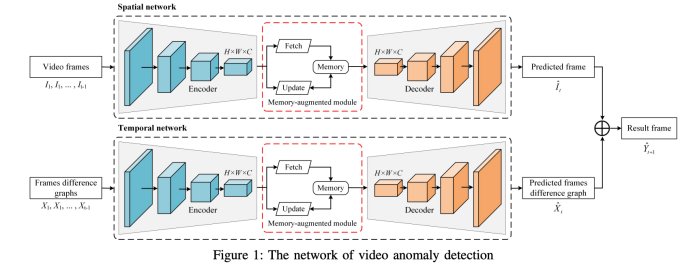
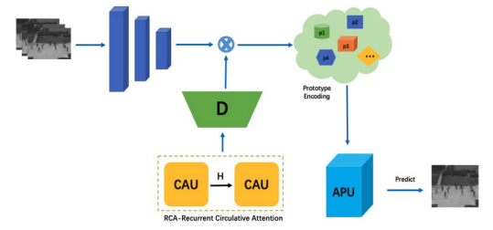
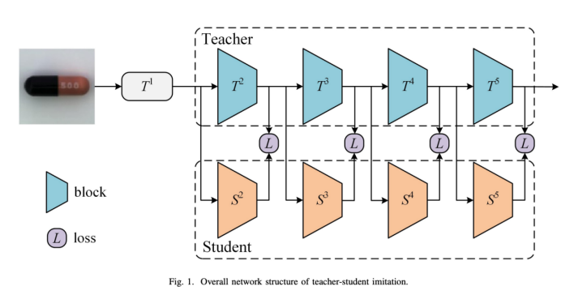
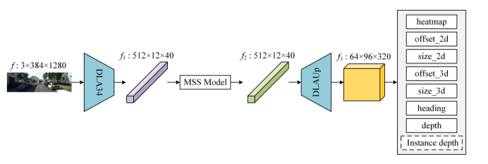
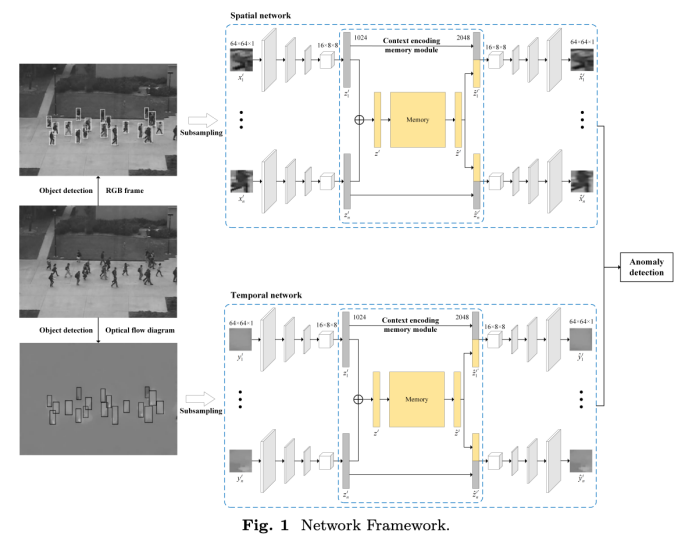
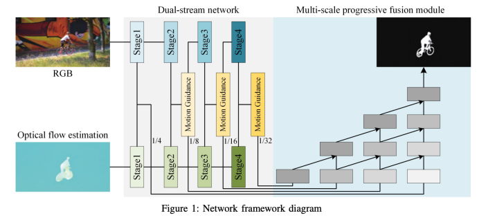
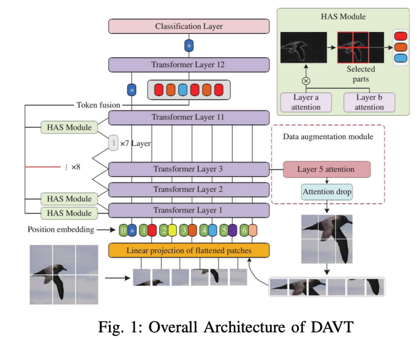
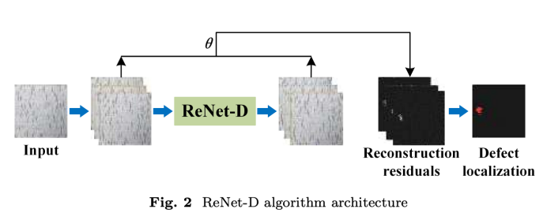

<!--
 * @Description: 
 * @Author: Panbo Hey
 * @Date: 2024-06-03 08:52:18
 * @LastEditTime: 2024-06-05 09:49:09
 * @LastEditors: Panbo Hey
-->
<!-- ---
layout: default
--- -->
# About Me

* ***Ph.D from Shanghai Jiao Tong University, currently working at Unicom (Shanghai) Industry Internet Co., Ltd. as a
  senior expert;***
* ***IEEE Senior Member, Stanford Visiting Scholar, Shanghai Artificial Intelligence Association Talent Expert, Jiangsu
  Artificial Intelligence Association Talent Expert, China Unicom Science and Technology Committee Expert;***
* ***Published more than 30 academic papers in important journals, such as CVPR, ECCV, ICCV, IEEE TIP;***
* ***Participated in the research on visual display of three-dimensional SD-OCT retinal image lesions (high-level talent
  project of "Six Talent Peaks" in Jiangsu Province);***
* ***Rich research experience in the field of artificial intelligence machine vision and pattern recognition;***

## Research Directions

***Deep vision, image processing, analysis and recognition, mainly include the following aspects:image segmentation,
object tracking, image generation, image recovery(denoising, enhancement, deblurring), unsupervised anomaly
detection.
LLM, base on Text, RAG,Langchain,llamaindex,Finetuning and chat bot***

## Education

<!-- * ***Ph.D in Computer Science, Shanghai Jiao Tong University, 2015.*** -->
* ***M.S. in Computer Science, University of Shanghai for Science and Technology, 2015.***
* ***B.E. in Computer Science, Xi’an University of Finance and Economics, 2010.***

## Academic Experience

> ***HOCHSCHULE COBURG academic exchange for Master degree, 2018.***
>
> ***The Institue of Sensor and Actuato Technology master thesis internship for 6 month, 2017.***
>
> ***Siemens Campus Erlangen internship for 3 month, 2017.***

## Appointment

***Reviewer for several domestic and foreign academic journals and conferences, such as IEEE Transactions
on Image Processing, Pattern Recognition, IEEE Transactions on Signal Processing, International Journal of Image
and Graphics, Computerized Medical Imaging and Graphics, Computer Methods and Programs in Biomedicine, Journal of Visual
Communication and Image Representation, Signal Processing, Journal of Computer-Aided Design and Computer Graphics,
Journal of Electronics and Information Technology, Journal of Chinese Journal of Image and Graphics, etc.***

## Publications

|                                                                    |                                                                                                                                 |
|:-------------------------------------------------------------------|:--------------------------------------------------------------------------------------------------------------------------------|
* ***[Panbo He, Chunxue Wu, Rami Yared, Yuanhao Ma, "HRM: An Intelligent Helmet Recognition Model in Complex Scenes", Advances in Mathematical Physics, vol. 2022, Article ID 1352775, 10 pages, 2022. https://doi.org/10.1155/2022/1352775](https://www.hindawi.com/journals/amp/2022/1352775/)***
* ***[He, P., Wu, C., Liu, K., Xiong, N.N. (2021). Deep Reinforcement Learning Based on Spatial-Temporal Context for IoT Video Sensors Object Tracking. In: Qiu, M. (eds) Smart Computing and Communication. SmartCom 2020. Lecture Notes in Computer Science(), vol 12608. Springer, Cham. https://doi.org/10.1007/978-3-030-74717-6_24](https://link.springer.com/chapter/10.1007/978-3-030-74717-6_24)***
* ***[Yijian Zhu, Shengting sun, Panbo HE. Mask Recognition and Detection Method Based on Improved Yolov3. Data Science And Industrial Internet. Sep.2019, Volume2, Issue 2, pp107-112]***
* ***[贺盼博, 邬春学. 基于多约束条件的改进遗传算法路径规划[J]. 软件导刊, 2018, 17(7):5.]***
* ***[孙盛婷, 贺盼博, 马远浩. 基于二元卷积神经网络的快速目标检测法[J]. 电子技术与软件工程, 2020(9):4.]***
* ***[戴长江, 马远浩，贺盼博. 基于端到端框架的食品图像检测法[J]. 电子技术与软件工程, 2021(9):4.]***
* ***[肖洒, 贺盼博, and 崔强. "一种复杂背景下的智能手势识别模型." 电子技术与软件工程 (2022).]***
* ***[专利：一种基于注意力机制的视频异常检测算法，专利号：CN202210702178.5，发明人：姚健，孙盛婷，胡超，邬伟杰，顾剑锋，赖盛鑫，贺盼博]***
* ***[专利：一种结合深度学习的复杂场景工地头盔检测算法，公布号：CN115457435A，发明人：孙盛婷,胡超,贺盼博,邬伟杰,赖盛鑫]***

**For other academic achievements, please refer to relevant journals.**

<!-- |     | ***[Pedestrian Spatio-Temporal Information Fusion For Video Anomaly Detection](https://arxiv.org/pdf/2211.10052.pdf)***         |
|     | ***[Normal Learning in Videos with Attention Prototype Network](https://arxiv.org/pdf/2108.11055.pdf)***                        |
|     | ***[Multi-scale Feature Imitation for Unsupervised Anomaly Localization](https://arxiv.org/pdf/2212.05786.pdf)***               |
|   | ***[IDMS: Instance Depth for Multi-scale Monocular 3D Object Detection](https://arxiv.org/pdf/2212.01528v1.pdf)***              |
|     | ***[Spatio-Temporal-based Context Fusion for Video Anomaly Detection](https://arxiv.org/pdf/2210.09572.pdf)***                  |
|     | ***[Efficient Unsupervised Video Object Segmentation Network Based on Motion Guidance](https://arxiv.org/pdf/2211.05364.pdf)*** |
|   | ***[Data Augmentation Vision Transformer for Fine-grained Image Classification](https://arxiv.org/pdf/2211.12879.pdf)***        |
|   | ***[A Lightweight Reconstruction Network for Surface Defect Inspection](https://arxiv.org/pdf/2212.12878.pdf)***                |

* ***[Application Strategy of Security Detection Technology in the Background of Computer Vision](https://liuluyanglly.github.io/)***
* ***[A Fast Monocular 3D Object Detection Fusing Instance Depth](https://liuluyanglly.github.io/)***

**For other academic achievements, please refer to relevant journals.** -->

